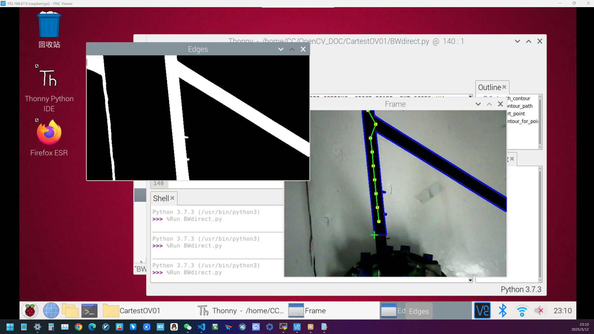

# NUEDC openCV+树莓派 循迹练习 

## 第一次更新

当前能用的就是这个BWdirect.py,**基本解决后方黑线汇入问题**。

还有如下问题：

1. **直角弯，向后的锐角弯无法解决**

2. 可能存在的算法不够精简

算法层面解决对策：

现在只有从起点始的行扫描，**那么如果出现一行一个蓝色点都扫不到，那么可以认为路径直角弯（或等效）,那就更改扫描方向至列扫描**，

再标记黄色点。(好吧其实最无敌的是对角线扫描，或许也不行吧)

2025/03/12 😭多累啊

ChrisChan
